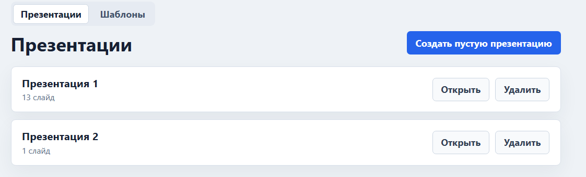
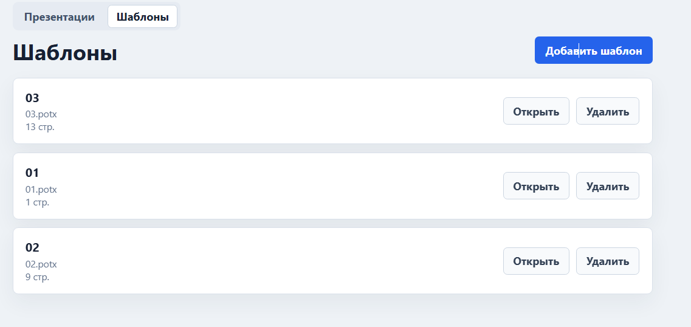
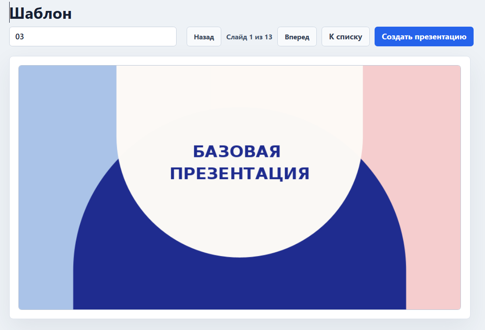
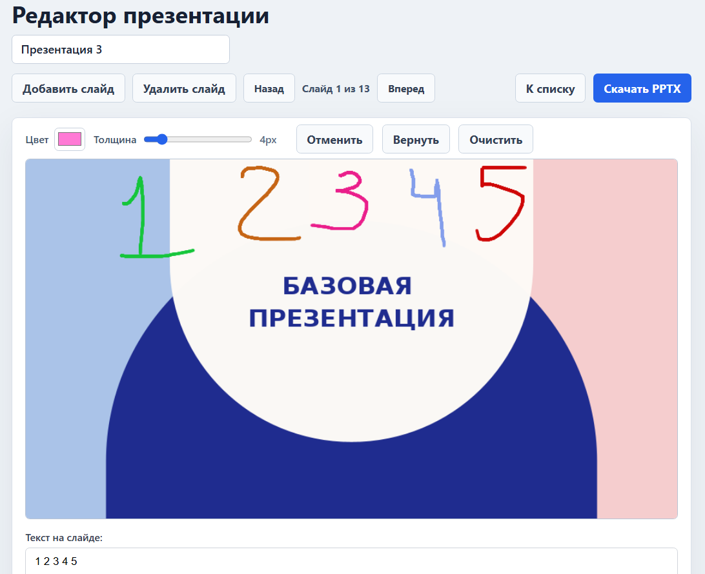
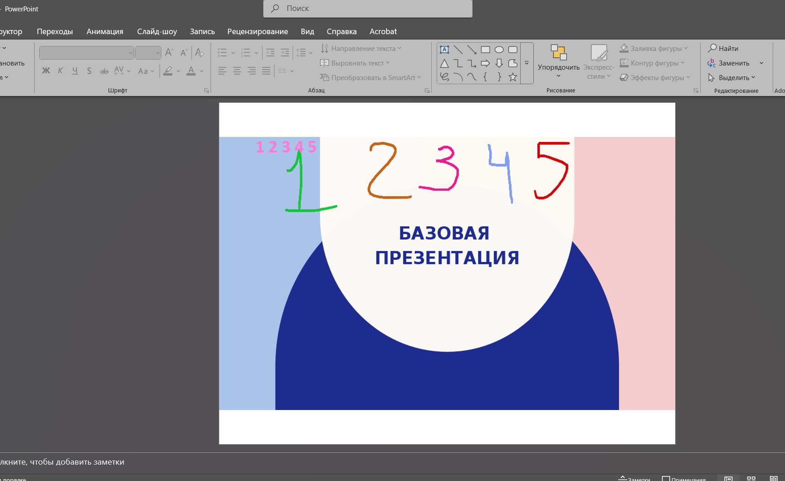
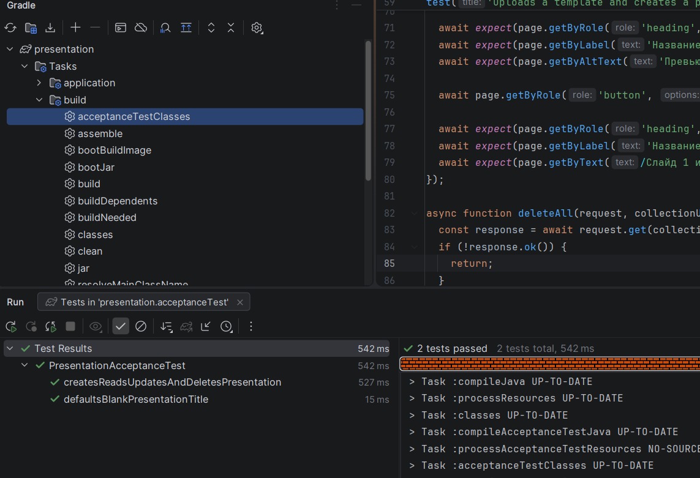
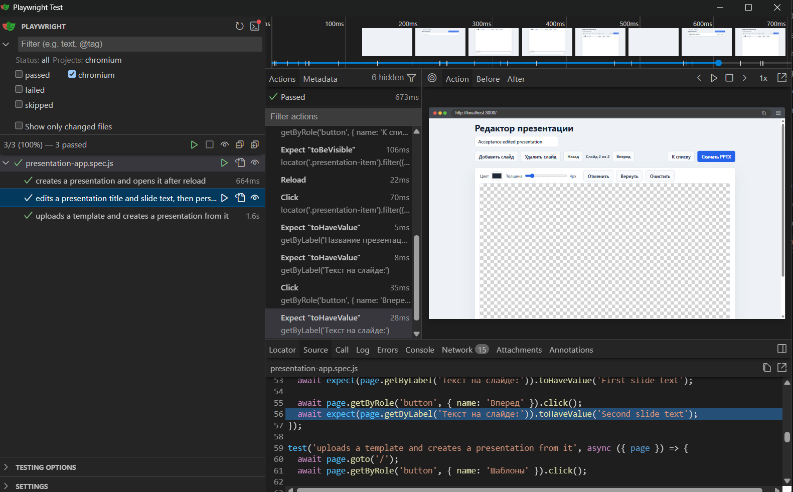
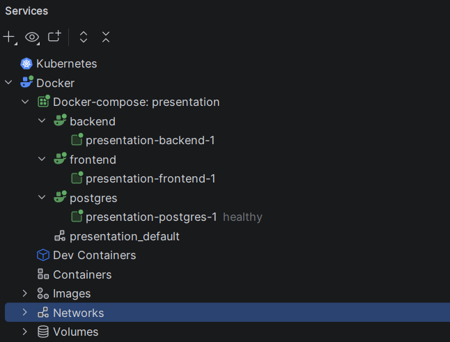

# Генератор презентаций

### Возможно создать пустую презентацию "с ноля"

### Возможно загрузить в БД шаблон в виде .potx-файла

### Возможно нагляно изучить шаблон. Доступна навигация по слайдам

### Возможно создать презентацию из шаблона. Поддерживается редактор: рисование элементов с возможность откатить/вернуть шаг. Возможность добавить произвольный текст 

### Весь дизайн, текст - будуть загруженыт добавлены на соответствующие слайды итогового .pptx-файла с презенатцией. Тест будет интерактивный, в виде layout-элемента

### Backend Acceptance-тесты. Завязаны в задачу Gradle

### Frontend Acceptance-тесты. Реализованы через playwright

### Приложение реализовано в виде Docker-контейнеров: Backend, Frontend, БД 

